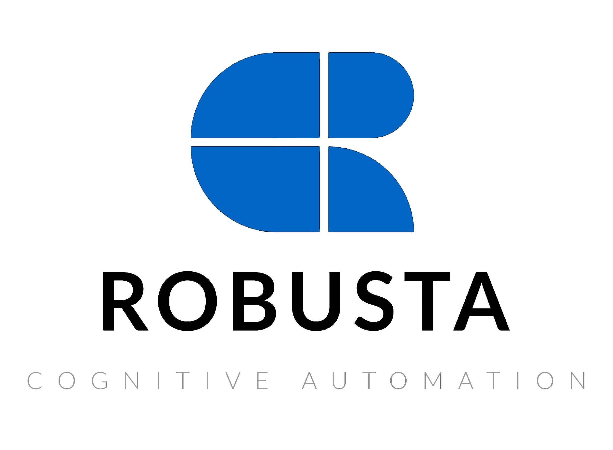
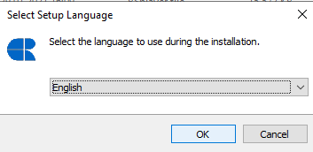
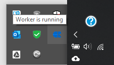
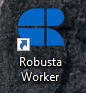
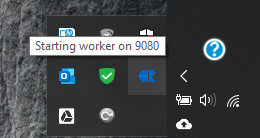
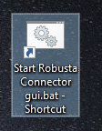



# **Installing Robusta RPA Orchestrator**

This section covers the creation and installation of robot worker files. It shows step by step in Windows environment.

# **Starting Robusta RPA Worker**

This section was created to ensure that the robot worker is working after the installation is complete.

                                             

# **Connection  to Robusta Orchestrator Web Application**

After making sure that the robot worker is working, the connection of the orchestra is completed by providing the relevant information. And our robot worker is ready to create a new process and run.

